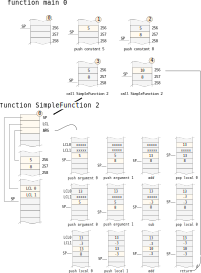

# VM - Funções

<iframe width="1000" height="569" src="https://www.youtube.com/embed/Hp4ZwLMvYfg" frameborder="0" allow="accelerometer; autoplay; encrypted-media; gyroscope; picture-in-picture" allowfullscreen></iframe>

A linguagem VM possibilita o uso de funções, as funções são definidas em novos arquivos .vm na mesma pasta do arquivo Main.vm. Por exemplo :

Na pasta do projeto `H-VM/src/vmExamples/SimpleFunction` possuímos duas funções: O `Main.vm` e a `SimpleFunction.vm`. A função main deve sempre deve existir no projeto, e será a primeira chamada na inicialização do sistema (assim como no python e C).

Para definirmos uma função em VM basta criarmos um arquivo com a extensão `.vm` (que precisa ter o mesmo nome da função) que será como uma classe do nosso projeto, podendo conter mais que um método/função. 

!!! note
    Olhe o exemplo `src/vmExamples/StatiTest/` para ver como isso funciona.

Uma função é definida pela seguinte estrutura :

- **function** *functionName* *numberOfVars*

Onde :

- **function:** é uma palavra reservado (keyword) para definir funções
- **functionName:** é o nome da função
- **numberOfVars:** a quantidade de variáveis locais que essa função possui.
    
Como exemplo, vamos transformar a seguinte função em Python para VM:

```python
def SimpleFunction(a, b):
   aux0 = a + b
   aux1 = a - b
   return(aux1+aux0)
```

Em VM:

```
function SimpleFunction 2
    push argument 0
    push argument 1
    add
    pop local 0       // aux0 = a + b
    push argument 0
    push argument 1
    sub
    pop local 1       // aux1 = a - b
    push local 0
    push local 1
    add               // aux0 + aux1
    return
```

Essa função possui duas variáveis locais, que pode ser acessada pelo segmento **local**, os parâmetros passados para a função (a e b) são acessíveis pelo segmento **argument** :

- **push argument 0** 

      - acessa o primeiro argumento da função ( **a** ), trazendo o dado para a pilha.
      
- **push argument 1** 

      - acessa o primeiro argumento da função ( **b** ), trazendo o dado para a pilha.
      
- **push/pop temp 0** 

      - acessa ou grava na primeiro variável local da função ( **aux0** ).
      
- **push/pop temp 1** 

      - acessa ou grava na primeiro variável local da função ( **aux1** ).
      
Note que os parâmetros devem ser apenas leitura, não devendo escrever nesses segmentos.

## return

A função considera como retorno o último valor da pilha, e sempre retorna um único valor apenas.

## Chamada de função

A chamada de função ocorre na própria pilha, para isso é necessário colocar na pilha os parâmetros da função, no exemplo anterior :

```
     a
     b 
SP->
```

e em seguida fazer a chamada de função que possui a seguinte estrutura:

- **call** *functionName* *numberOfParameters* 

Onde :

- **call** : palavra reservada para chamada de funções
- **functioName** : nome da função a ser chamada
- **numberOfPar** : quantidade de parâmetros que essa função recebe.

O exemplo a seguir chama a função SimpleFunction com os valores 5 e 8 como argumentos / parâmetros da função.

```
function Main.main 0
    push constant 5
    push constant 8
    call SimpleFunction 2
```

## Graficamente


