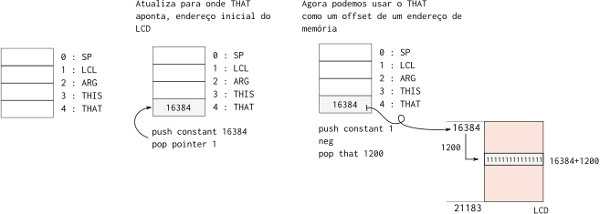

# VM - Segmentos

Os comandos **push** e **pop** são a única maneira que temos de acessar/manipular a memória. O comando **push** traz para a pilha um valor da memória (RAM ou ROM) e o comando **pop** salva na memória um valor da pilha (RAM). Os comandos possuem a seguinte sintaxe :

- **push** *segment index*
- **pop**  *segment index*

Onde *index* é um número inteiro positivo e *segment* pode ser um dos casos a seguir:

| segment   | Uso                                                      | Index | Comentário                                                                                    |
|-----------|----------------------------------------------------------|-------------------|-----------------------------------------------------------------------------------------------|
| ==argument==  | Local onde o argumento da função está salvo              | 0 ..              | Alocado dinamicamente pelo VMTranslator quando a função é chamada                             |
| ==local==     | Local das variáveis locais da função                     | 0 ..              | Alocado dinamicamente pelo VMTranslator quando a função é chamada                             |
| ==static==    | Local onde as variáveis do objeto estão salvos           | 0 ..              | Essas variáveis são compartilhadas por todas as funções do mesmo .vm, assim como em um objeto |
| constant  | Carrega uma constante na pilha                           | 0 .. 32767        | Mesmo uso do leaw (carrega da ROM um valor na RAM)                                            |
| ==this/that== | Segmentos de uso geral, pode apontar para qualquer lugar | 0 ..              | Usado para ler e escrever de endereços da memória, por exemplo, acessar o LCD                 |
| ==pointer==   | Altera os valores do this e do that                      | 0, 1              | Usado para modificar a onde o this e o that apontam                                           |
| ==temp==      | Local para uso de variáveis temporárias                  | 0 .. 7            | Acessado por qualquer função, é armazenado nos endereços R5 .. R12 da RAM                     |

### Exemplo, acessando o temp

Por exemplo, para trazermos para a pilha uma constante realizamos a seguinte operação:

```
push constant 15
```

- nesse caso o segmento acessado é o constant e o parâmetro é o 15.

Para salvarmos o valor 15 no *temp 3* (endereço da RAM 7), basta:

```
push constant 15
pop temp 3
```

Podemos também trazer o *temp 3* para a pilha:

```
push temp 3
```

### Escrevendo um pixel no LCD

Para atualizarmos o LCD via VM será necessário primeiro atualizarmos para onde o **that** aponta, **that** é a maneira que possuímos de escrever em qualquer endereço da memória. O exemplo a seguir ilustra como usamos o segmento **that** para escrever nos pixels centrais do LCD, supondo que gostaríamos de realizar a seguinte operação em C.

``` c
 int *pLCD = 16384
 *(pLCD + 1200) = 0xFFFF
```

Nesse pequeno código em C o que está acontecendo é que primeiramente definimos um ponteiro pLCD que aponta para 16384, depois fazemos com que o endereço desse ponteiro + 1200 receba 0xFFFF, o mesmo código em VM é realizado da seguinte maneira :




```
push constant 16384   -- carrega 16384 para a pilha
pop pointer 1         -- atualiza para onde that aponta (int *pLCD = 16384)
push contant 1        -- carrega 1 para a pilha
neg                   -- nega o 1 para obter o valor 0xFFFF
                      -- poderia ter realizado o push contant 4095 no lugar
                      -- dessas duas operações
pop that 1200         -- faz com que o endereço da memória 16384 + 1200 = 0xFFFF
```
